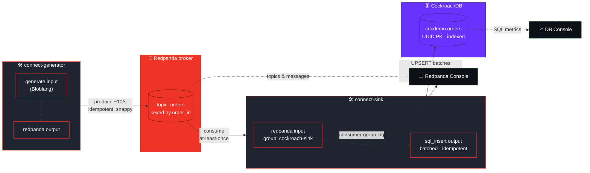
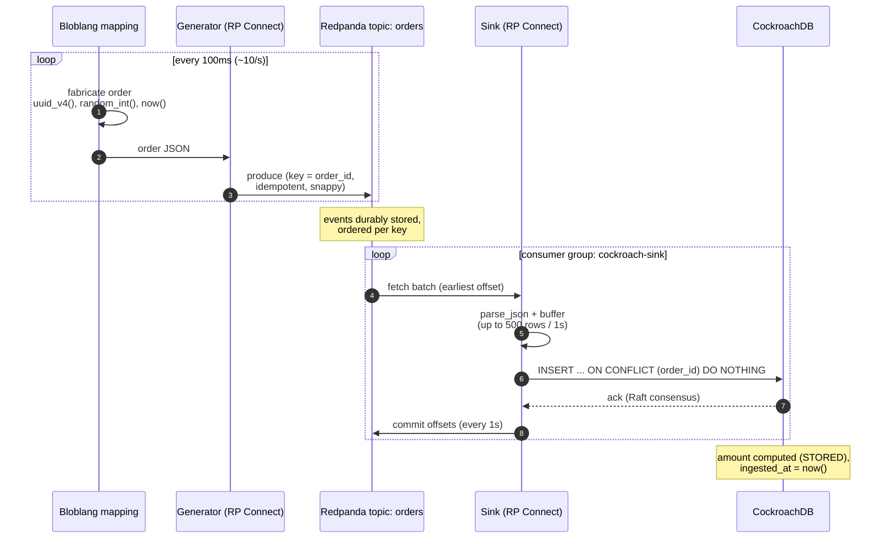
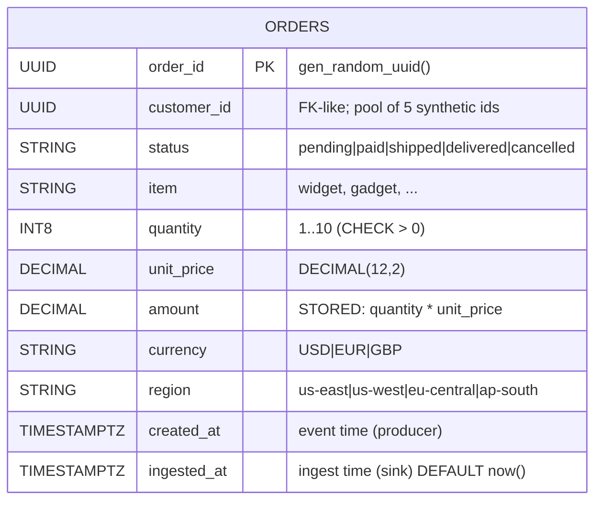
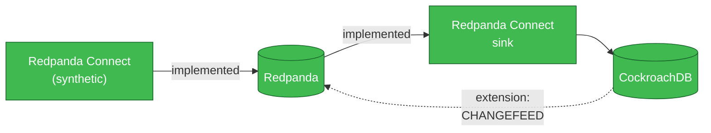

# Redpanda → CockroachDB Streaming Demo

> A turnkey, fully-containerized demo that **synthesizes data with Redpanda Connect,
> streams it through Redpanda, and lands it in CockroachDB** — with one-command
> deploy, verification, and live status. Built to Redpanda and CockroachDB best
> practices.

<p>


</p>

---

## Table of contents

- [Architecture](#architecture)
- [How a record flows](#how-a-record-flows-end-to-end)
- [Data model](#data-model)
- [Prerequisites](#prerequisites)
- [Quickstart](#quickstart)
- [Command reference](#command-reference)
- [Endpoints](#endpoints)
- [Project layout](#project-layout)
- [Configuration](#configuration)
- [Data dictionary](#data-dictionary)
- [Best practices applied](#best-practices-applied)
- [Checking connector status](#checking-connector-status)
- [Troubleshooting](#troubleshooting)
- [How this maps to CDC](#how-this-maps-to-cdc)

---

## Architecture

Two independent Redpanda Connect pipelines, a Redpanda broker, and a CockroachDB
node — all on one Docker network. The broker decouples generation from ingestion,
so either side can be scaled, paused, or restarted without losing data.



| Component | Container | Role |
|-----------|-----------|------|
| **Generator** | `connect-generator` | Redpanda Connect `generate` + Bloblang → fabricates synthetic order events |
| **Broker** | `redpanda` | Durable, ordered log; topic `orders` |
| **Sink** | `connect-sink` | Redpanda Connect `redpanda` → `sql_insert`; batched, idempotent writes |
| **Database** | `cockroachdb` | Distributed SQL store; table `cdcdemo.orders` |
| **Console** | `redpanda-console` | Web UI for topics & consumer groups |
| **Schema init** | `crdb-init` | One-shot job that applies `schema.sql` before the sink starts |

---

## How a record flows end-to-end



The split offset-commit (sink commits **after** the DB acknowledges) is what makes
delivery **at-least-once**; the `ON CONFLICT DO NOTHING` upsert makes a redelivered
event a harmless no-op, so the net result is **effectively exactly-once** into the table.

---

## Data model



Two covering secondary indexes back the demo's read patterns:

- `idx_orders_customer_created (customer_id, created_at DESC)` → a customer's order history.
- `idx_orders_status_created (status, created_at DESC)` → orders-by-status dashboards.

Both `STORING` the columns those queries select, so they're satisfied from the index
alone (verified with `EXPLAIN` — single scan, no primary-index lookup).

---

## Prerequisites

| Requirement | Version used / tested | Notes |
|-------------|----------------------|-------|
| **Docker Engine** | 28.x | Must be running. The entire stack is containerized. |
| **Docker Compose** | v2.40+ | Bundled with Docker Desktop. Uses `healthcheck` / `depends_on`. |
| **Disk** | ~2 GB free | For the four images. |
| **Free host ports** | 19092, 18082, 9644, 8088, 26257, 8080, 4195, 4196 | See [Endpoints](#endpoints). |
| `make` *(optional)* | any | Convenience targets; you can run the scripts directly instead. |
| `rpk` *(optional)* | v25+ | Only for linting pipelines on the host (`make lint`). Not needed to run the demo. |

> **No local CockroachDB / Redpanda / Java install needed** — everything runs in
> containers. Nothing is provisioned in the cloud and no credentials are required;
> the demo is self-contained and free to run.

Pinned images (in `docker-compose.yml`):

| Component | Image |
|-----------|-------|
| Redpanda broker | `redpandadata/redpanda:v25.1.1` |
| Redpanda Console | `redpandadata/console:v3.0.0` |
| CockroachDB | `cockroachdb/cockroach:v25.2.1` |
| Redpanda Connect | `docker.redpanda.com/redpandadata/connect:4.69.0` |

---

## Quickstart

```bash
./scripts/up.sh          # or: make up      — start stack, wait healthy, apply schema
./scripts/verify.sh      # or: make verify  — prove data flows synthetic → Redpanda → CockroachDB
make status              # live throughput snapshot (ACTIVE/IDLE)
make connectors          # health of both Redpanda Connect pipelines
./scripts/down.sh        # or: make down    — tear down + remove volumes
```

`verify.sh` confirms the topic has messages, the `cockroach-sink` group is committing
offsets, and the CockroachDB row count **grows between two reads 5s apart** — then prints
sample rows, aggregations, and data-integrity checks (computed `amount` matches, zero
duplicate `order_id`s).

---

## Command reference

Run `make help` to list these any time.

| Command | What it does |
|---------|--------------|
| `make up` | Start the stack, wait for health, confirm schema applied. |
| `make verify` | End-to-end verification (live streaming + integrity checks). |
| `make status` | One snapshot of producer/ingest rates; `make watch` for a live dashboard. |
| `make watch` | Auto-refreshing status dashboard (Ctrl-C to stop). |
| `make connectors` | Health & throughput of both pipelines (`/ready` + `/stats`). |
| `make logs` | Tail logs for both Connect pipelines. |
| `make lint` | Lint both pipelines with local `rpk connect lint`. |
| `make psql` | Open a SQL shell on CockroachDB (`cdcdemo`). |
| `make topic` | Show the `orders` topic and `cockroach-sink` consumer group. |
| `make down` / `make clean` | Stop the stack and remove volumes. |

Scripts (`scripts/`) are the underlying implementations and also take flags, e.g.
`./scripts/down.sh --keep-data`, `./scripts/status.sh --watch`,
`./scripts/connectors.sh --watch`.

---

## Endpoints

| Service | URL / address | Purpose |
|---------|---------------|---------|
| Redpanda Kafka API | `localhost:19092` | Produce/consume from the host (e.g. `rpk`). |
| Redpanda Console | http://localhost:8088 | Browse topics, messages, consumer groups. |
| Redpanda Admin / metrics | `localhost:9644` | Cluster admin API. |
| CockroachDB SQL | `postgres://root@localhost:26257/cdcdemo?sslmode=disable` | Any Postgres client. |
| CockroachDB DB Console | http://localhost:8080 | Cluster / SQL observability UI. |
| Connect generator API | http://localhost:4195 | `/ping`, `/ready`, `/stats`, `/version`. |
| Connect sink API | http://localhost:4196 | `/ping`, `/ready`, `/stats`, `/version`. |

---

## Project layout

```
.
├── docker-compose.yml        # Full stack: broker, console, CockroachDB, schema init, 2× Connect
├── cockroach/
│   └── schema.sql            # cdcdemo.orders — CockroachDB-best-practice schema
├── connect/
│   ├── generator.yaml        # generate (Bloblang) → redpanda topic "orders"
│   └── sink.yaml             # redpanda topic "orders" → sql_insert into CockroachDB
├── scripts/
│   ├── up.sh                 # bring up + wait for health + confirm schema
│   ├── verify.sh             # end-to-end verification
│   ├── status.sh             # producer/ingest throughput snapshot (--watch)
│   ├── connectors.sh         # pipeline health from the HTTP status API (--watch)
│   └── down.sh               # tear down (--keep-data to keep volumes)
├── Makefile                  # up / verify / status / watch / connectors / logs / lint / psql / topic / down
├── .env.example              # optional generator tuning (rate, count)
└── .gitignore                # ignores .env & secrets (keeps .env.example)
```

---

## Configuration

Copy `.env.example` to `.env` to tune the generator (Compose reads it automatically):

```bash
GENERATE_INTERVAL=100ms   # time between events (~10/sec). e.g. 10ms for ~100/sec
GENERATE_COUNT=0          # 0 = forever; set e.g. 1000 to produce a fixed batch then stop
```

Both pipelines are parameterized via environment variables (broker address, topic,
consumer group, CockroachDB DSN), so the same configs run unchanged against an
external Redpanda cluster or CockroachDB Cloud — just change the values in
`docker-compose.yml` (and the DSN to use TLS).

---

## Data dictionary

| Column | Type | Source | Notes |
|--------|------|--------|-------|
| `order_id` | `UUID` | `uuid_v4()` | Primary key; random to spread writes across ranges. |
| `customer_id` | `UUID` | pool of 5 fixed synthetic UUIDs | Lets a customer accrue history. |
| `status` | `STRING` | random from 5 values | `CHECK` constrained. |
| `item` | `STRING` | random from 7 generic names | widget, gadget, sprocket, … |
| `quantity` | `INT8` | `random_int(1,10)` | `CHECK (quantity > 0)`. |
| `unit_price` | `DECIMAL(12,2)` | `random_int(100,50000)/100` | Money → DECIMAL, never FLOAT. |
| `amount` | `DECIMAL(12,2)` | **computed STORED** | `quantity * unit_price`; not written by the sink. |
| `currency` | `STRING` | random USD/EUR/GBP | |
| `region` | `STRING` | random from 4 macro regions | us-east, us-west, eu-central, ap-south. |
| `created_at` | `TIMESTAMPTZ` | `now()` at generation | Producer event time. |
| `ingested_at` | `TIMESTAMPTZ` | `DEFAULT now()` at insert | Sink ingest time; `now() - max(ingested_at)` ≈ end-to-end lag. |

---

## Best practices applied

**CockroachDB** (`cockroach/schema.sql`)
- **UUID primary key** (`gen_random_uuid()`) to distribute writes and avoid the
  sequential-ID hotspot of `SERIAL`/identity columns.
- Correct types: **`TIMESTAMPTZ`** for time, **`DECIMAL(12,2)`** for money (never `FLOAT`).
- **Computed `STORED` column** (`amount`) — consistent and indexable.
- **Covering secondary indexes** with `STORING` for the two main read patterns
  (`EXPLAIN`-verified to avoid extra primary-index lookups).
- `CHECK` constraints for status/quantity validity; idempotent `IF NOT EXISTS` DDL.

**Redpanda / Redpanda Connect** (`connect/*.yaml`)
- Modern native **`redpanda`** input/output components.
- Producer: **`idempotent_write`** + Snappy compression; messages **keyed by `order_id`**
  so a key's events stay ordered on one partition.
- Consumer: **durable consumer group** with committed offsets → restart-safe,
  at-least-once delivery.
- Sink: **batched writes** (`count: 500`, `period: 1s`) for throughput, with
  **`ON CONFLICT (order_id) DO NOTHING`** for idempotent re-delivery.
- Health/metrics endpoints exposed for observability.

**Deployment** (`docker-compose.yml`)
- **Pinned image versions** for reproducibility.
- **Health checks** on Redpanda and CockroachDB; dependents start only once their
  dependencies are healthy (`depends_on: condition: service_healthy`).
- Schema applied by a **one-shot init container** that the sink waits on
  (`service_completed_successfully`) — the sink never writes before the table exists.

---

## Checking connector status

Self-hosted Redpanda Console has **no UI page for Redpanda Connect pipelines** — that
view exists only in Redpanda Cloud. Instead, each pipeline exposes an HTTP
status/metrics API (generator `:4195`, sink `:4196`):

| Endpoint | Tells you |
|----------|-----------|
| `GET /ping` | process is alive (`pong`) |
| `GET /ready` | whether **input and output are connected** — the key health signal |
| `GET /stats` | Prometheus metrics: `input_received`, `output_sent`, `output_error`, `*_connection_up`, `output_batch_sent` |
| `GET /version` | build info |

One command summarizes both pipelines:

```bash
make connectors          # or: ./scripts/connectors.sh   (add --watch to refresh)
```
```
 CONNECTOR  PING    READY   CONNS        IN(recv)    OUT(sent)   ERRORS
 generator  up      ready   1in/1out        18080        18080        0
 sink       up      ready   1in/1out        26990        26980        0
```

Raw checks if you prefer curl:

```bash
curl localhost:4195/ready   # {"statuses":[{...,"connected":true}, ...]}
curl localhost:4196/stats | grep -E 'output_(sent|error)'
```

In **Redpanda Console** (http://localhost:8088) the pipelines also surface indirectly:
- **Topics → `orders`** — the generator's output (rate, count).
- **Consumer Groups → `cockroach-sink`** — the sink consuming, with live lag.

Because `/stats` is Prometheus-formatted, you can point Grafana/Prometheus at
`:4195` and `:4196` for dashboards and alerting.

---

## Inspecting the stream manually

```bash
# Read raw events off the topic (or use the Console UI):
docker exec redpanda rpk topic consume orders --num 3

# Topic + consumer-group lag:
make topic

# Query CockroachDB:
make psql
#   > SELECT count(*) FROM orders;
#   > SELECT customer_id, count(*), sum(amount) FROM orders GROUP BY customer_id ORDER BY 2 DESC;
```

---

## Troubleshooting

| Symptom | Cause / fix |
|---------|-------------|
| `up.sh` reports a service "NOT healthy" | First run pulls images; re-run after `docker compose pull` completes. Check `docker compose logs <service>`. |
| Port already in use | Another process holds 19092/26257/8080/8088/etc. Stop it or edit the `ports:` in `docker-compose.yml`. |
| `verify.sh`: no rows in CockroachDB | Check the sink: `docker logs connect-sink`. Confirm `crdb-init` printed `schema applied` (`docker logs crdb-init`). |
| `make connectors` shows `NOT-READY` / `DOWN` | A connector lost its broker or DB connection. Inspect `docker logs connect-<generator\|sink>`; confirm the broker is healthy (`docker exec redpanda rpk cluster health`). |
| Sink errors about a missing table/column | Schema didn't apply. Re-run: `docker compose up crdb-init`. |
| Generator produced 0 messages | Check `docker logs connect-generator`; confirm the broker is healthy. |
| Want a clean slate | `./scripts/down.sh` (removes volumes), then `./scripts/up.sh`. |

---

## How this maps to CDC

This demo implements the **ingest path**: Redpanda is the streaming backbone and
CockroachDB is the sink, with Redpanda Connect doing synthetic generation and the load.



To extend it into a full change-data-capture **loop**, CockroachDB can emit a
[**`CHANGEFEED`**](https://www.cockroachlabs.com/docs/stable/change-data-capture-overview)
back into Redpanda (CockroachDB → Redpanda), closing the cycle. That direction is a
natural next step and is intentionally omitted to keep this demo simple.
