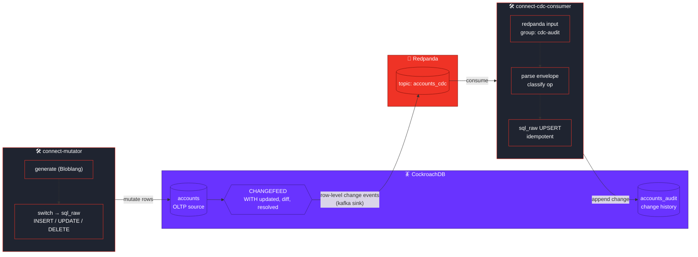
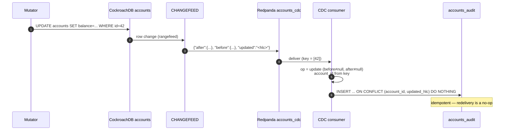
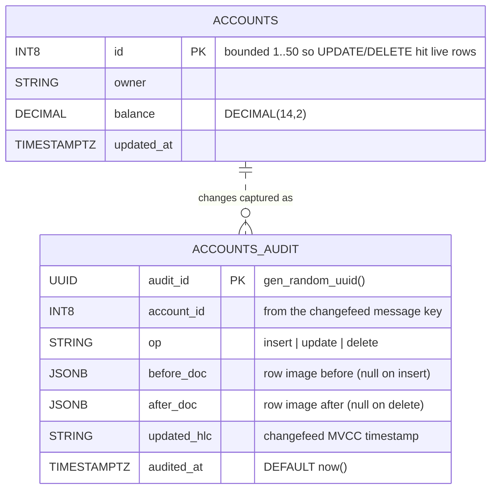

# CockroachDB CHANGEFEED → Redpanda CDC Demo

> Captures **row-level changes (INSERT / UPDATE / DELETE)** from CockroachDB using a
> native **`CHANGEFEED`**, streams them into Redpanda, and a **Redpanda Connect**
> pipeline materializes the change history into an audit table. Fully containerized,
> with one-command deploy and verification.

<p>


</p>

This is the **complement** to the root [streaming demo](../README.md): that one ingests
*into* CockroachDB (Redpanda → CockroachDB); this one captures changes *out of*
CockroachDB (CockroachDB → Redpanda), closing the CDC loop.

> **Why not the `postgres_cdc` input?** CockroachDB does not implement PostgreSQL
> logical replication (no `wal_level`, no publications, no replication slots), so
> Redpanda Connect's `postgres_cdc` input cannot capture from it. CockroachDB's
> native CDC mechanism is the **`CHANGEFEED`**, which is what this demo uses.

---

## Architecture



| Component | Container | Role |
|-----------|-----------|------|
| **Mutator** | `cf-connect-mutator` | Redpanda Connect `generate` → `switch`/`sql_raw`; drives INSERT/UPDATE/DELETE on `accounts` |
| **Source DB** | `cf-cockroachdb` | Holds `accounts`; a `CHANGEFEED` emits every row change |
| **Broker** | `cf-redpanda` | Topic `accounts_cdc` carries the change stream |
| **CDC consumer** | `cf-connect-cdc-consumer` | Redpanda Connect consumes the stream, classifies each event, upserts `accounts_audit` |
| **Console** | `cf-redpanda-console` | Web UI for the topic & consumer group |
| **Init** | `cf-crdb-init` | One-shot: schema + `kv.rangefeed.enabled` + creates the CHANGEFEED |

---

## How a change is captured



**Event classification** (from the changefeed `diff` envelope):

| `before` | `after` | → op | Notes |
|----------|---------|------|-------|
| null | row | **insert** | new row |
| row  | row | **update** | carries old *and* new image |
| row  | null | **delete** | carries the deleted row image |
| null | null | **delete** | rapid insert→delete coalesced between checkpoints; key still identifies the row |

`account_id` is taken from the **message key** (the primary key, always present), so even
coalesced tombstones get a correct id. `{"resolved": ...}` checkpoint markers are dropped.

---

## Data model



`UNIQUE (account_id, updated_hlc)` is the CDC **idempotency key** — the MVCC timestamp
uniquely identifies a row-version change, so `ON CONFLICT DO NOTHING` makes the consumer
exactly-once into the audit log despite Redpanda's at-least-once delivery.

---

## Prerequisites

Same as the root demo: **Docker Engine 28.x**, **Docker Compose v2.40+**, ~2 GB disk.
Host ports are **offset** from the root demo so both can run simultaneously:

| Service | This demo | (Root demo) |
|---------|-----------|-------------|
| Redpanda Kafka API | `29092` | 19092 |
| Redpanda Console | `8089` | 8088 |
| CockroachDB SQL | `26258` | 26257 |
| CockroachDB Console | `8081` | 8080 |
| Mutator metrics | `4295` | — |
| CDC consumer metrics | `4296` | — |

Images are pinned (Redpanda `v25.1.1`, Console `v3.0.0`, CockroachDB `v25.2.1`,
Redpanda Connect `4.69.0`). No enterprise license is required for the changefeed on
this version of CockroachDB running as a single insecure node.

---

## Quickstart

```bash
./scripts/up.sh        # or: make up      — start stack, apply schema, create the CHANGEFEED
./scripts/verify.sh    # or: make verify  — prove changes flow source → changefeed → Redpanda → audit
make status            # live CDC throughput
make jobs              # show the CockroachDB changefeed job
./scripts/down.sh      # or: make down    — tear down + remove volumes
```

`verify.sh` confirms the changefeed job is running, the `accounts_cdc` topic has
messages, `accounts_audit` grows live, **all three change types are captured**, and it
reconstructs the full change history of the busiest account from the audit log.

---

## Command reference

| Command | What it does |
|---------|--------------|
| `make up` / `make down` | Start / tear down the stack. |
| `make verify` | End-to-end CDC verification. |
| `make status` / `make watch` | CDC throughput snapshot / live dashboard. |
| `make jobs` | Show CockroachDB `SHOW CHANGEFEED JOBS`. |
| `make changefeed-health` | CockroachDB-side CDC health: status + high-water progress + emitted metrics. |
| `make topic` | Show the `accounts_cdc` topic and `cdc-audit` consumer group. |
| `make psql` | SQL shell on CockroachDB (`cdcbank`). |
| `make logs` | Tail mutator + CDC consumer logs. |
| `make lint` | Lint both pipelines with local `rpk`. |

---

## Project layout

```
changefeed-demo/
├── docker-compose.yml          # Redpanda, Console, CockroachDB, init, mutator, CDC consumer
├── cockroach/
│   ├── schema.sql              # accounts + accounts_audit (idempotency key)
│   └── init.sh                 # schema + enable rangefeed + CREATE CHANGEFEED
├── connect/
│   ├── mutator.yaml            # generate → switch → sql_raw (INSERT/UPDATE/DELETE)
│   └── cdc-consumer.yaml       # accounts_cdc → parse envelope → upsert accounts_audit
├── scripts/                    # up / verify / status / down
└── Makefile
```

---

## Confirming CDC on the CockroachDB side

The authoritative "is CDC working?" check lives in CockroachDB's job system, not in
Redpanda. `make changefeed-health` bundles the four signals:

```bash
make changefeed-health
```
```
 job status             running      OK
 active changefeeds     1            (changefeed.running)
 high-water progress    ....s        ▲ advancing  OK
 emitted messages       2051         ▲ +14  emitting
 emitted bytes          408566
```

| Signal | Healthy | Trouble |
|--------|---------|---------|
| `SHOW CHANGEFEED JOBS` status | `running` | `paused` / `failed` (see `SHOW JOBS` → `error`) |
| `high_water_timestamp` | advancing | frozen → sink unreachable / backpressure |
| `changefeed.running` metric | ≥ 1 | 0 → no active changefeed |
| `changefeed.emitted_messages` | climbing | flat → not capturing changes |

You can also use the **DB Console** at http://localhost:8081 → **Jobs** (filter to
Changefeed) and **Metrics → Changefeeds** (emitted rate, commit latency, restarts).

## Inspecting the change stream

```bash
# Raw changefeed events (note the before/after/updated envelope and the [id] key):
docker exec cf-redpanda rpk topic consume accounts_cdc --num 3 --format 'key=%k value=%v\n'

# Reconstruct one account's history from the audit log:
make psql
#  > SELECT op, before_doc->>'balance' AS old_bal, after_doc->>'balance' AS new_bal, updated_hlc
#  >   FROM accounts_audit WHERE account_id = 27 ORDER BY audited_at;

# The changefeed job and its high-water mark:
make jobs
```

---

## Best practices applied

**CockroachDB CDC**
- `CHANGEFEED ... WITH updated, diff, resolved` — `updated` gives MVCC timestamps,
  `diff` gives before-images, `resolved` emits periodic checkpoints.
- `kv.rangefeed.enabled` set before creating the changefeed.
- Changefeed creation is **idempotent** (init skips if one is already running).

**Redpanda Connect**
- Mutator uses a **`switch` output** to route each generated op to the right
  `sql_raw` statement.
- Consumer keys `account_id` off the **message key** (robust for tombstones),
  drops `resolved` markers, and classifies op from the before/after images.
- **Idempotent UPSERT** on `(account_id, updated_hlc)` → exactly-once audit log.
- Durable consumer group with committed offsets.

**CockroachDB schema**
- `accounts_audit` uses a UUID PK (insert-only, high volume) plus the
  `(account_id, updated_hlc)` unique idempotency key and a covering history index.

---

## Troubleshooting

| Symptom | Cause / fix |
|---------|-------------|
| `up.sh`: init didn't complete | Check `docker logs cf-crdb-init`. The changefeed sink needs Redpanda healthy (init depends on it). |
| No rows in `accounts_audit` | Check `docker logs cf-connect-cdc-consumer`. Confirm the changefeed job is `running` via `make jobs`. |
| Duplicate audit rows | Shouldn't happen — the `(account_id, updated_hlc)` UNIQUE + `ON CONFLICT DO NOTHING` dedupes. Verify the constraint exists (`make psql` → `SHOW CONSTRAINTS FROM accounts_audit`). |
| Only `insert` events | The mutator needs to be running and hitting existing ids; check `docker logs cf-connect-mutator`. |
| Port already in use | Another stack holds 29092/26258/8089/8081. Stop it or edit `ports:` in `docker-compose.yml`. |
